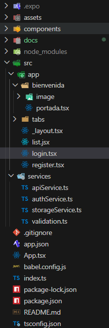

# 📱 PGL-LOGIN

# Introducción
Este proyecto es una aplicación móvil desarrollada con **React Native** y **Expo Router** que implementa un sistema de registro e inicio de sesión de usuarios mediante tokens.

# La aplicación permite al usuario:
* Registrarse con nombre, email y contraseña.
* Iniciar sesión y guardar su sesión en el dispositivo.
* Recibir un mensaje de bienvenida personalizado al pulsar un botón.
* Navegar por pantallas privadas: Bienvenida, Portfolio y Lista de Animes.
* Cerrar sesión cuando quiera salir de su cuenta.

# Objetivos
* Crear un flujo de autenticación completo con registro y login.
* Guardar el token en el almacenamiento del dispositivo con AsyncStorage.
* Proteger las pantallas privadas para que solo se vean si hay sesión iniciada.
* Mostrar un mensaje de bienvenida personalizado para usuarios autenticados.
* Implementar un cierre de sesión que borre el token y devuelva al login.
* Organizar el código separando pantallas, servicios y validac

# Estructura del Proyecto

# Descripción de las Pantallas
* **Login** (`login.tsx`): formulario de inicio de sesión. Valida los datos, guarda el token y lleva a Bienvenida.
* **Registro** (`register.tsx`): formulario de registro. Tras crear la cuenta, redirige al login.
* **Bienvenida** (`bienvenida/portada.tsx`): pantalla privada con un botón para comprobar el token y otro para cerrar sesión.
* **Portfolio** (`tabs/`): pantalla con mis hobbies y mi QR del repositorio.
* **Lista de Animes** (`list.jsx`): listado de animes.
* 
# Servicios
* **`constants.ts`**: URL del servidor, rutas de los endpoints y clave del token guardadas en un único sitio.
* **`apiService.ts`**: función base que se encarga de hablar con el servidor. Pone las cabeceras correctas y maneja los errores.
* **`authService.ts`**: funciones para registrarse, iniciar sesión y comprobar el token. Actualmente funciona en modo offline usando AsyncStorage. El código que llama a la API real está comentado al final del archivo.
* **`storageService.ts`**: guarda, recupera y borra el token del dispositivo usando AsyncStorage.
* **`validation.ts`**: comprueba que los emails y contraseñas son válidos antes de procesarlos.

# Flujo de la Aplicación
* El usuario abre la app → se comprueba si hay token guardado.
* Si **no hay token** → se muestra la pantalla de Login.
* Desde el Login puede ir al Registro si todavía no tiene cuenta.
* Si se **registra correctamente** → vuelve al Login para iniciar sesión.
* Si **inicia sesión correctamente** → se guarda el token y va a Bienvenida.
* En Bienvenida puede pulsar "Comprobar token" para ver el mensaje personalizado.
* El Drawer (menú lateral) permite navegar entre Bienvenida, Portfolio y Lista de Animes.
* Al **cerrar sesión** → se borra el token y se vuelve al Login.


# Documentación de los ejercicios
[Ejercicio 1](docs/EjercicioUno.md)
[Ejercicio 2](docs/EjercicioDos.md)
[Ejercicio 3](docs/EjercicioTres.md)
[Ejercicio 4](docs/EjercicioCuatro.md)
[Ejercicio 5](docs/EjercicioCinco.md)
[Ejercicio 6](docs/EjercicioSeis.md)
[Adri guapo](docs/AdriDocs.md)

# Frontend (React Native + Expo)

Asegúrate de estar dentro de la carpeta del proyecto (donde está el `package.json`).

▶️ Instalar dependencias
* npm install

▶️ Ejecutar la app
* npm start

Esto abrirá Expo. Desde ahí puedes lanzar la app en:

* Android → presiona `a`
* iOS → presiona `i` (solo en macOS)
* Web → presiona `w`

# Modo offline (actual)

Como el servidor presentaba problemas de conexión, se ha implementado un modo offline:
* Los usuarios registrados se guardan en AsyncStorage del dispositivo.
* El token de sesión se genera localmente al iniciar sesión.
* El mensaje de bienvenida se genera con el nombre del usuario que se registró.

Esto permite probar la app sin necesidad del servidor mientras se mantiene la misma lógica de validaciones, guardado de token y protección de pantallas.

# Reactivar la conexión con la API

Para volver a usar la API real:

1. En `src/services/authService.ts` comentar las funciones del modo offline (las que están al inicio del archivo).
2. Descomentar el bloque que está al final del archivo (entre `/* */`).
3. En `src/services/constants.ts` poner la IP del servidor:

```ts
export const API_BASE_URL = "http://192.168.X.X:8000";
```

# Ejecutar la app en un dispositivo físico

Necesitas la app **Expo Go**:

* Android → Google Play
* iOS → App Store

Luego escaneas el QR que aparece en la consola o en la ventana de Expo.

# Otros comandos útiles

Limpiar caché de Expo (si falla algo):
* npm start -- --clear

Instalar Expo CLI global (opcional):
* npm install -g expo-cli

Actualizar dependencias de Expo:
* npx expo install

# GABRIEL DAVID GELVIZ MONTERREY
