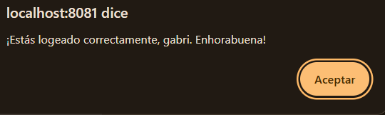

# Ejercicio Cinco
# 5. Comprobar el token desde la pantalla de bienvenida

## ¿Para qué sirve esto?

Sirve para **verificar que el token guardado funciona** y para mostrar al usuario un mensaje personalizado del servidor. El servidor tiene un endpoint llamado `/welcome` que es **privado**: solo responde si le enseñas un token válido.

Cuando el usuario pulsa el botón **"Comprobar token"** en la pantalla de bienvenida, la app:

1. Coge el token guardado en el móvil.
2. Lo envía al servidor en la cabecera `Authorization: Bearer <token>`.
3. El servidor revisa el token y, si es válido, devuelve un mensaje personalizado con el nombre del usuario.
4. La app muestra ese mensaje en una alerta.

## ¿Por qué es importante esto?

Porque demuestra el **ciclo completo de autenticación**:

1. Te registras.
2. Inicias sesión y recibes un token.
3. Usas ese token para hacer peticiones privadas al servidor.
4. El servidor confía en ti porque le enseñas el token.

[Volver al README](../README.md)