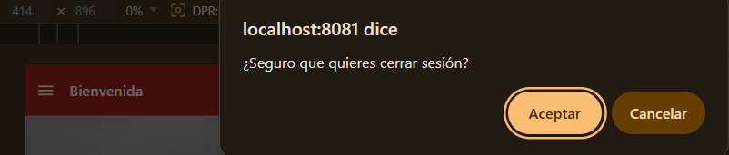

# Ejercicio Cuatro

## ¿Dónde está el botón?

He puesto el botón **"Cerrar sesión"** en la **pantalla de bienvenida**, debajo del botón de comprobar token y del botón de ir al Portfolio. Así, en cuanto el usuario quiere salir de su cuenta, lo tiene a mano sin tener que ir a otro sitio.

## ¿Qué pasa cuando se pulsa?

Cuando el usuario pulsa el botón "Cerrar sesión", la app hace tres cosas:

1. **Le pregunta si está seguro** con un cuadro de confirmación. Esto es para que no cierre sesión sin querer.
2. Si dice que sí:
   - **Borra el token del móvil** llamando a `removeToken()`, que internamente usa AsyncStorage para eliminarlo.
   - **Redirige al usuario al login** usando `router.replace("/login")`. La diferencia entre `replace` y `push` es que `replace` no permite "volver atrás" con el botón de retroceso, así que el usuario no puede volver a la pantalla privada sin iniciar sesión de nuevo.
  

[Volver Al Readme](../README.md)
