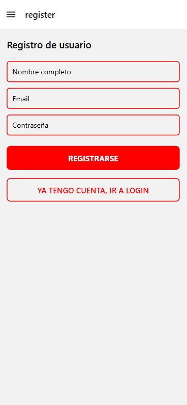

# Ejercicio Dos
* Objetivo: Crear una nueva cuenta de usuario.
* Acción: Enviar datos al endpoint de registro.
* Resultado esperado: Usuario registrado y redirigido a /tabs o /bienvenida.

[Volver Al Readme](../README.md)
