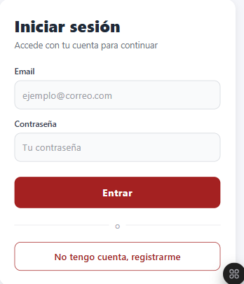

# Ejercicio Dos

## Pantalla de login de usuario

## Objetivo
Permitir al usuario autenticarse con **email y contraseña**, recibir el **token JWT** del backend y guardarlo en el dispositivo.

## Descripción
La pantalla `app/login.tsx` contiene:
- Dos inputs: **email** y **contraseña**.
- Un **enlace al registro** (`/register`) para usuarios nuevos.
- Validación de que el campo email tenga formato válido antes de llamar a la API.
- Un botón **"Entrar"** que llama a `POST /auth/login` mediante `login()` del `authService`.

[Volver Al Readme](../README.md)
