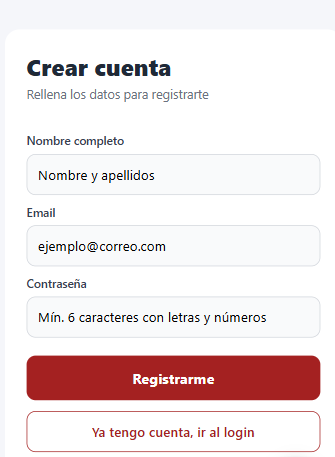

# Ejercicio Uno
## Pantalla de registro de usuario

Esta es la pantalla donde una persona puede **crear una cuenta nueva** en la app. Le pide tres datos:

- **Nombre completo**: cómo se llama (ejemplo: *Gabriel Gelviz*).
- **Email**: su correo electrónico (ejemplo: *gabriel@correo.com*).
- **Contraseña**: una clave para entrar más tarde.

Si cualquiera de estas tres comprobaciones falla, sale una **alerta** en pantalla explicando el problema y NO se envía nada al servidor. Esto evita peticiones innecesarias y le da una respuesta rápida al usuario.

## ¿Qué pasa cuando se envía al servidor?

Si los datos son válidos, la app llama al servidor (concretamente al endpoint `POST /auth/register`) enviándole el nombre, el email y la contraseña. Pueden pasar tres cosas:

- **Todo bien (código 201)**: el servidor crea la cuenta y devuelve los datos del usuario. La app muestra una alerta "Registro exitoso" y **redirige al usuario a la pantalla de login** para que inicie sesión con la cuenta que acaba de crear.
- **Falta el cuerpo de la petición (código 400)**: muy raro, pero la app lo controla mostrando el mensaje que devuelva el servidor.
- **El email ya está registrado (código 409)**: si alguien intenta crear una cuenta con un email que ya existe, el servidor responde con error y la app muestra una alerta indicándolo.

## ¿Por qué redirigir al login después del registro?

Porque registrarse y entrar son dos cosas distintas:
- **Registrarse**: crear la cuenta.
- **Iniciar sesión**: usar esa cuenta para entrar.

Tras crear la cuenta, el usuario tiene que iniciar sesión a propósito. Esto está pedido literalmente en el enunciado: *"Tras un registro exitoso debe redirigirse a la pantalla de login"*.

[Volver Al Readme](../README.md)

